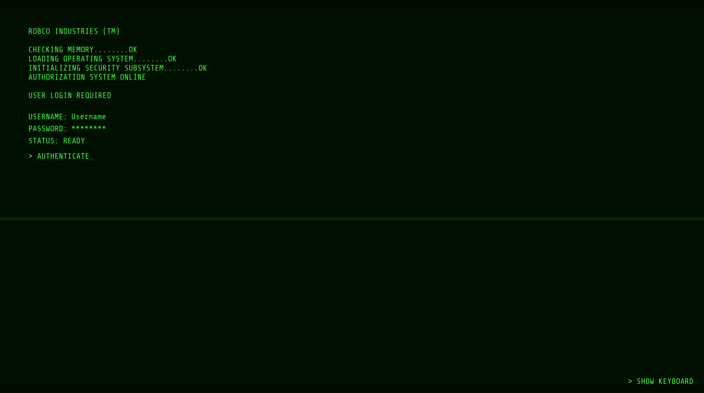
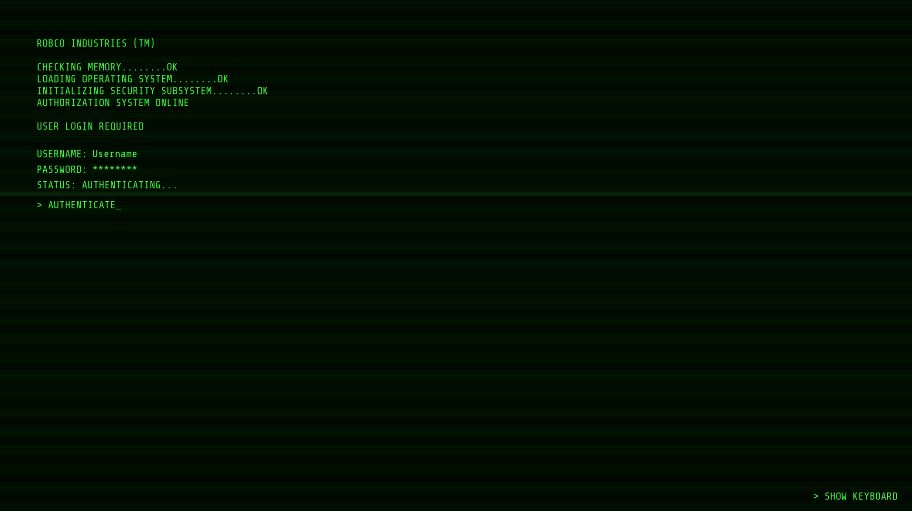
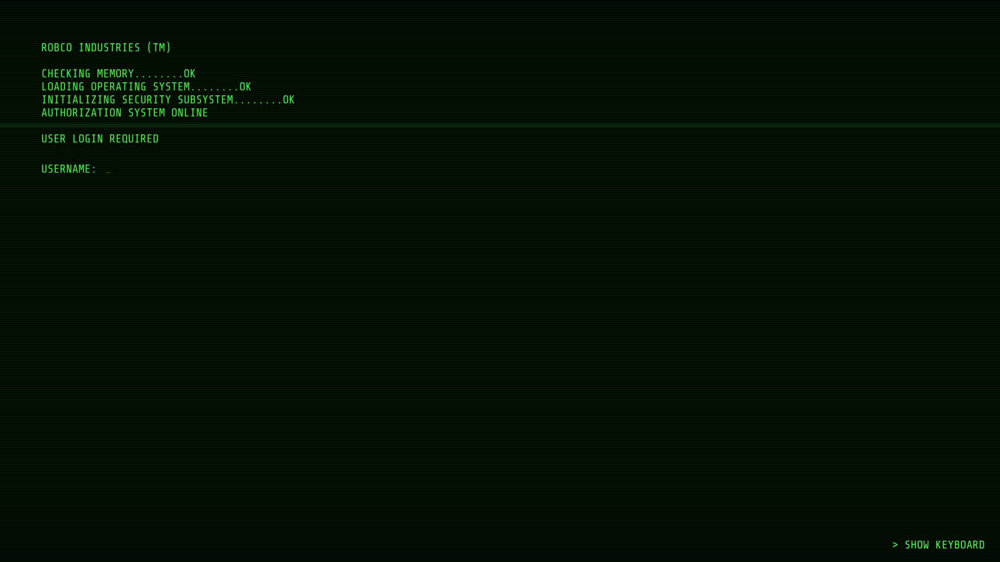

# Fallout SDDM

A Fallout-inspired SDDM login theme built for Qt 6 and SDDM 0.21+.



## Features

- Qt6 native (`sddm-greeter-qt6`)
- Fallout-style terminal boot sequence
- Randomized terminal typing sounds
- Power-on startup sound
- Power-off authentication sound
- Manual virtual keyboard toggle
- Adjustable volume controls
- Designed for Arch Linux but should work on any SDDM installation supporting Qt6

## Requirements

- SDDM 0.21+
- Qt6
- Qt Multimedia
- Qt Virtual Keyboard (optional)

## Installation

Copy the theme:

```bash
sudo cp -r fallout-sddm /usr/share/sddm/themes/
```

Set it as the active theme:

```bash
printf "[Theme]\nCurrent=fallout-sddm\n" | sudo tee /etc/sddm.conf
```

Verify:

```bash
cat /etc/sddm.conf
```

Expected:

```ini
[Theme]
Current=fallout-sddm
```

## Sound Controls

Near the top of `Main.qml`:

```qml
property real keyVolume: 0.5
property real systemVolume: 1.0
```

| Setting | Description |
|---|---|
| `keyVolume` | Typing and terminal sounds |
| `systemVolume` | Power-on and power-off sounds |

## Virtual Keyboard

The theme includes a manual virtual keyboard toggle in the lower-right corner.

Virtual keyboard support is optional. To enable SDDM's Qt Virtual Keyboard, create an SDDM configuration file containing:

```ini
[General]
InputMethod=qtvirtualkeyboard
```

## Directory Layout

```text
fallout-sddm/
├── Main.qml
├── metadata.desktop
├── Sounds/
├── Themes/
│   └── fallout.conf
├── translations/
└── Screenshots/
```

## Screenshots

### Authentication



### Boot Sequence



## License

MIT
